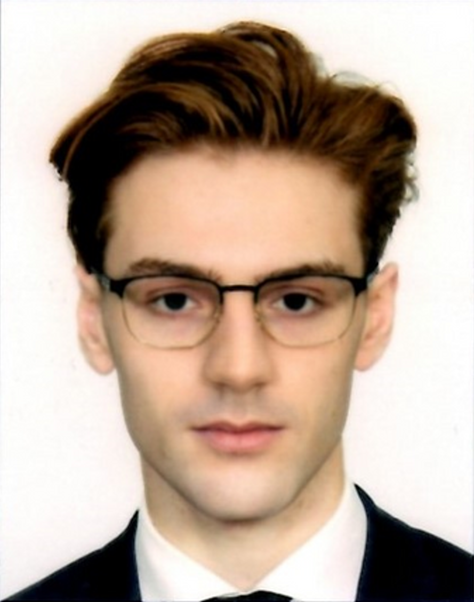

# Dawid Piotrowski

- 📞 668 407 667
- 📧 [dpiotrowski393939@gmail.com](mailto:dpiotrowski393939@gmail.com)
- 🔗 [GitHub](https://github.com/LeoTheOriginal)
- 🔗 [LinkedIn](https://www.linkedin.com)
- [Download my CV (PDF)](https://github.com/LeoTheOriginal/my-cv/raw/main/CV.pdf)

This repository contains my professional curriculum vitae along with additional resources and projects related to my career in computer science.

## About Me
I am an active student of Applied Computer Science at AGH University of Science and Technology in Krakow, focusing on the design and implementation of advanced information systems. I am known for my strong commitment to academic life and my constant search for new challenges. I am open to new experiences that broaden my technological horizons and enhance my interpersonal skills. I passionately pursue learning new technologies and methodologies, making me adaptable and responsive to changes in the rapidly evolving IT industry.

## Education

**AGH University of Science and Technology**  
_Bachelor of Engineering in Applied Computer Science_  
Expected Feb 2026  
Krakow, Poland  

Relevant Coursework:
- Advanced Data Structures and Algorithmic Analysis
- System Programming with C
- Statistical Methods and Applications in MATLAB
- Object-Oriented Programming with C++
- Fundamentals of Functional Programming in Scala
- System Administration with Bash and PowerShell
- Graphical Computing in C++

**II Liceum Ogólnokształcące im. Jana III Sobieskiego**  
_Mathematics-Physics-Chemistry Class_  
September 2019 – May 2022  
Krakow, Poland  

- AGH Primus Scholarship.
- Laureate of the Golden Index competition at Cracow University of Technology.
- Finalist in the Chemistry Competition at the Jagiellonian University.

## Experience

**Study Research Group Bit**  
_Software Engineer Intern_  
Nov 2023 – Present  
Cracow, Poland  

- Participated in advanced software engineering projects focusing on modern web technologies and artificial intelligence, enhancing practical coding skills.
- Engaged in collaborative development of algorithms designed to solve complex problems, which improved problem-solving techniques and analytical thinking.
- Contributed to peer-led workshops on introductory and advanced topics in computer science, fostering a community of learning and skill development.

**Szkoła Maturzystów Łukasza Jarosińskiego**  
_Tutor in Mathematics and Physics_  
Sep 2023 – Present  
Cracow, Poland  

- Developed and conducted tutoring sessions in mathematics and physics, focusing on exam preparation and problem-solving skills.
- Created personalized learning plans for students, resulting in improved understanding of complex topics and higher exam scores.
- Utilized a variety of teaching tools and techniques to enhance student engagement and facilitate active learning.

## Projects

**Advanced Charting Interface | C++, wxWidgets**  
- Developed a sophisticated charting application using C++ and the wxWidgets library, allowing for dynamic graphical representation of mathematical functions.
- Implemented a configuration class that supports extensive customization of chart parameters and interface settings, enhancing user interactivity and flexibility.
- Engineered GUI components using wxWidgets, including custom dialogs and settings panels, to provide an intuitive user experience and facilitate effective data visualization.

**Retro Sokoban Clone | C++ with SFML**  
- Recreated the classic puzzle game Sokoban, implementing it in C++ to enhance gameplay with a focus on maintaining the nostalgic feel of the original game using the SFML library.
- Incorporated modern game design elements while respecting the retro aesthetics and mechanics that define the Sokoban experience.
- Optimized graphical rendering and game logic for efficient performance on modern computing hardware, ensuring a smooth player experience.

## Technical Skills
**Languages**: Python3, Scala3, C++ (C++17/20), C, MATLAB, Bash, PowerShell  
**Tools and Technologies**: Git, MATLAB  
**Frameworks and Libraries**: SFML, wxWidgets (used for GUI development)  
**Software and Platforms**: Git  
**Languages and Protocols**: English (B2+/C1), German (A2)

Thank you for your interest in my CV!
